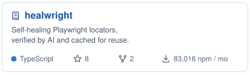
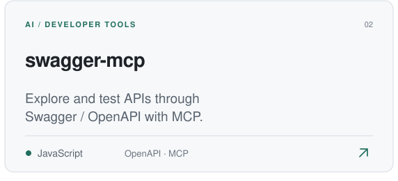
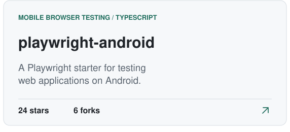
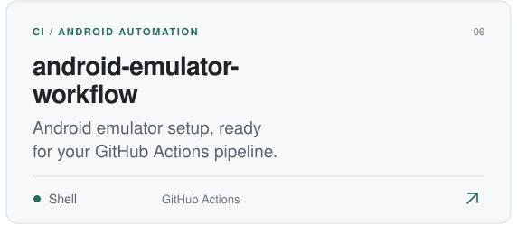

<picture>
  <source media="(prefers-color-scheme: dark)" srcset="./assets/profile-header-dark.svg" />
  
</picture>

# Amr Salem

**QA Principal · Automation Engineer · QA Lead**

I build automation for web, mobile and APIs, and help teams make quality part of everyday delivery. My work spans test strategy, performance engineering and CI/CD, with a growing focus on practical applications of AI in testing and developer tools.

[Portfolio](https://amr-salem.com) &nbsp; / &nbsp; [LinkedIn](https://www.linkedin.com/in/amrsalem1/) &nbsp; / &nbsp; [Medium](https://medium.com/@Amr.sa) &nbsp; / &nbsp; [Email](mailto:akamel.salim@gmail.com)

## Selected projects

Open source tools for better testing, simpler infrastructure and useful AI.

<a href="https://github.com/amrsa1/healwright"><picture><source media="(prefers-color-scheme: dark)" srcset="./assets/project-cards/dark/healwright.svg" /></picture></a> <a href="https://github.com/amrsa1/swagger-mcp"><picture><source media="(prefers-color-scheme: dark)" srcset="./assets/project-cards/dark/swagger-mcp.svg" /></picture></a>

<a href="https://github.com/amrsa1/multimodal-hybrid-rag"><picture><source media="(prefers-color-scheme: dark)" srcset="./assets/project-cards/dark/multimodal-hybrid-rag.svg" /></picture></a> <a href="https://github.com/amrsa1/Android-Emulator-image"><picture><source media="(prefers-color-scheme: dark)" srcset="./assets/project-cards/dark/Android-Emulator-image.svg" /></picture></a>

<a href="https://github.com/amrsa1/playwright-android"><picture><source media="(prefers-color-scheme: dark)" srcset="./assets/project-cards/dark/playwright-android.svg" /></picture></a> <a href="https://github.com/amrsa1/android-emulator-workflow"><picture><source media="(prefers-color-scheme: dark)" srcset="./assets/project-cards/dark/android-emulator-workflow.svg" /></picture></a>

<strong>More projects</strong> · API, mobile, desktop and developer tooling

| Project | What it does |
| :--- | :--- |
| [playwright-APITesting](https://github.com/amrsa1/playwright-APITesting) | A structured starting point for API test automation with Playwright. |
| [wdio-nativeApp](https://github.com/amrsa1/wdio-nativeApp) | Native Android automation with WebdriverIO and GitHub Actions. |
| [wdio-xplatform-mobile-app](https://github.com/amrsa1/wdio-xplatform-mobile-app) | WebdriverIO testing for Android and iOS, with CI workflows. |
| [desktopAppAutomationTest](https://github.com/amrsa1/desktopAppAutomationTest) | A practical proof of concept for desktop automation with WebdriverIO. |
| [GPT-unitTest](https://github.com/amrsa1/GPT-unitTest) | Generate unit tests with OpenAI and run them with a test runner. |
| [UniParser](https://github.com/amrsa1/UniParser) | Convert PDF, DOCX, HTML, Markdown and text files into plain text. |

[Explore all repositories →](https://github.com/amrsa1?tab=repositories)

## Writing

Notes from building tools, testing software and exploring AI.

- **[Astur: Mobile Automation Can’t Get Any Easier](https://medium.com/@Amr.sa/astur-mobile-automation-cant-get-any-easier-61b3d648cf3d)** Making mobile automation easier to work with.
- **[Healwright: Let Your Playwright Tests Heal Their Own Selectors](https://medium.com/@Amr.sa/healwright-let-your-playwright-tests-heal-their-own-selectors-on-the-fly-d0178568f9bc)** A practical approach to self-healing locators.
- **[When Code Gets Repackaged with an AI Facelift](https://medium.com/@Amr.sa/when-code-gets-repackaged-with-an-ai-facelift-6b027330f0ff)** A perspective on AI, software and originality.

## Toolkit & focus

| Area | Tools & practice |
| :--- | :--- |
| Test automation | Playwright · WebdriverIO · Selenium · Appium |
| APIs & performance | REST · OpenAPI · Contract testing · Load & scalability testing |
| Mobile & delivery | Android · Cross-platform testing · Docker · GitHub Actions · Quality gates |
| Applied AI | AI-assisted testing · MCP · RAG · Test generation |

---

Building better software through better quality engineering.
